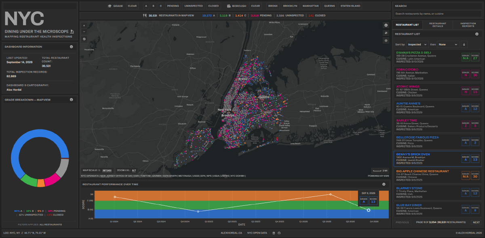

# NYC Restaurant Inspection Dashboard



An interactive map for exploring New York City health-department restaurant inspection data. Built with Vite, React, TypeScript, the ArcGIS Maps SDK, and Recharts.

**Live site:** [nyc-teal.vercel.app](https://nyc-teal.vercel.app)

## What it does

Every inspected NYC restaurant shows up as a dot on the map, coloured by its health grade. As you pan and zoom, the side list, the stats panel, and the grade-breakdown chart all update to match what's on screen. Click a restaurant to see its full inspection history, past violations, and score over time.

### Map

- One dot per restaurant, coloured by grade (A, B, C) or by state (pending, uninspected, closed).
- Hovering a dot when zoomed in shows a small card with the name, grade, and score.
- A stats panel counts the restaurants currently in view, split by grade.
- A donut chart shows that same split as proportions.
- Hovering or selecting a restaurant highlights it on the map, in the list, and in the chart at once.
- Custom map controls: zoom buttons, a compass, a scale bar, a satellite-imagery toggle, and scale and zoom-level readouts you can click and type into to jump to an exact value.
- **Search radius:** drop a point on the map and the list, stats, and chart re-scope to a 0.25 / 0.5 / 1 mile circle around it instead of the whole map view. The list gains a distance column.
- **Locate me (phone only):** uses your device location to show where you are and sort the list by distance. The location is only held for the session — never saved, shared, or put in the URL.

### Search and filtering

- Search by name, cuisine, or address. Handles accents, company suffixes like "INC" and "LLC", and street abbreviations ("St" matches "Street").
- Filter by grade and borough; sort the list by date, name, cuisine, grade, score, or distance.
- The active filters, search text, selected restaurant, and any placed search radius are all kept in the URL, so any view can be bookmarked or shared.

### Restaurant details

- Details load only when you select a restaurant, so the initial page stays light.
- Shows the current status (Open, Closed by DOHMH, or Unknown), a score-over-time chart, and a breakdown of each past inspection — the type, the action taken, and the violations found.
- Violations are tagged Critical or Not Critical, with the official NYC code and category.

### Data quality

- The coordinates in the city data are often approximate. A separate step re-checks each address against [LocationIQ](https://locationiq.com/) — a geocoding service that turns a street address into a precise latitude/longitude — and corrects the position where it can.
- Every restaurant carries a location-confidence badge: Verified, Unverified, or Pending.

## How it's built

### Two branches

- **`main`** — the app. The `public/data/` folder is rebuilt from scratch on every deploy and is never committed.
- **`data`** — a separate branch holding only the geocoding cache. Kept apart so the daily cache updates never collide with in-progress app changes.

### Keeping it fast

The map is the heaviest part of the app (the ArcGIS SDK), so it loads on its own after the rest of the page, with a placeholder in the meantime. The two charts load the same way. If any of them fails to load, that one panel shows a reload message instead of taking down the whole dashboard.

### Responsive layout

- **Above 1750px:** a three-pane layout — map, list, and charts side by side.
- **640–1750px:** the panes stack into a scrolling two-column layout.
- **Below 640px:** a dedicated phone layout — a slim top bar, a full-screen map, and a bottom sheet that steps between three heights (a peek, half, and full). Search, filters, and info each open as a drawer over the map.

### Accessibility

The dashboard works with a keyboard and a screen reader: visible focus outlines on every control, the restaurant panel is a proper tab set, the list cards and sort menu follow standard keyboard patterns, the info dialog keeps focus inside it, the charts have arrow-key navigation, and animations switch off when the system asks for reduced motion.

## Data pipeline

### The build step

`pipeline/fetch-inspection.mjs` runs on every deploy. It downloads the full NYC DOHMH inspection dataset from the Socrata API and writes four files:

| File | What it holds |
|---|---|
| `latest-inspections.geojson` | One point per restaurant with its most recent scored inspection — drives the map, stats, and chart |
| `history/{camis}.json` | Each restaurant's full inspection history, loaded on demand when it's selected |
| `violation-codes.json` | Violation code to description and category |
| `dashboard-meta.json` | Dataset totals and last-updated info shown in the app |

It fetches in pages of 50,000 rows and checks the total against Socrata's own row count — if they don't match, it stops rather than publish a partial dataset. Restaurants with no scored inspection are dropped, obviously-bad coordinates (like 0,0 or swapped values) are caught against a rough NYC bounding box, and text is normalised for the search index.

### Geocoding (separate, runs daily)

Geocoding does **not** run during the build. A scheduled GitHub Action (`geocode-backfill.yml`, around 5am Atlantic) looks up new or changed restaurants against LocationIQ, capped at about 4,900 a day to stay under the free tier, commits the updated cache to the `data` branch, and triggers a Vercel rebuild. After that each run only has a handful of new or changed restaurants to do.

The daily cap mainly matters for the first full backfill. The dataset is around 30,500 restaurants, so filling an empty cache from scratch takes roughly a week of daily runs. This is rarely necessary: a normal build, local or on Vercel, does not geocode anything itself — `prebuild` pulls the already-committed cache down from the `data` branch and the build reads it directly. A LocationIQ key is only required to run the backfill manually.

Each cache entry is marked `verified`, `unverified`, or `pending`, and stamped with a resolver version so the matching rules can be bumped to force a re-check. A verified match that moves a restaurant more than 100m from the city's own coordinates is still used, but its details are also written to a log file for manual review. The only thing that pulls a geocoded point back to the city's coordinates is failing the NYC bounds check, which also drops it to `unverified`.

### Key pipeline files

| File | Purpose |
|---|---|
| `fetch-inspection.mjs` | Build-time entry point — downloads and shapes the dataset |
| `run-geocode-backfill.mjs` | The scheduled geocoding run; the only place LocationIQ is called |
| `backfill-core.mjs` | The geocoding loop — quota tracking and incremental saves |
| `resolve.mjs` | Resolves one restaurant — network call, scoring, quota check |
| `geocode.mjs` | LocationIQ HTTP wrapper with the rate-limit delay |
| `scoring.mjs` | Decides whether a geocoding result is a good enough match |
| `cache.mjs` | Loads and saves the geocode cache, using atomic writes |
| `normalize.mjs` | Address formatting and search-token normalisation |
| `merge-and-commit-cache.mjs` | Merges a run's results into the `data` branch without clobbering concurrent runs |
| `prebuild.mjs` | Pulls the cache down from `data` before the build runs |
| `backfill.mjs` | Local manual-test entry point against a sample file |
| `reset-out-of-bounds-cache-entries.mjs` | One-off cleanup for bad cache entries |

## Testing

Two separate suites, both run in CI on every push and pull request to `main`.

**Pipeline** (`npm run test:pipeline`) uses Node's built-in test runner, with no external library. It covers the geocode cache (atomic writes, recovery from corrupt files), the merge-and-push logic (which had a past data-loss bug), rate-limit handling, and address scoring — the scoring tests run against real saved API responses so CI never has to call LocationIQ.

**Frontend** (`npm run test:frontend`) uses Vitest, with tests sitting next to the code they cover. It covers the pure logic — grade categorisation, the map query builders, list sorting, the search-radius distance maths, the URL parse and serialise helpers — plus the custom React hooks, tested against small hand-built stand-ins for the ArcGIS SDK. Full component tests against the map itself aren't set up: they'd need a large SDK fake, and a headless DOM can't run the WebGL parts anyway.

## Tech stack

- **Vite + React 19 + TypeScript** — app and build
- **ArcGIS Maps SDK** — the map
- **Recharts** — the donut and score-history charts
- **Font Awesome** — icons
- **Public Sans and Archivo** — fonts, self-hosted with no CDN
- **Node.js** — the build and geocoding scripts
- **GitHub Actions** — the daily geocoding run and cache commits
- **Vercel** — hosting and automatic deploys
- **Data:** [NYC DOHMH Restaurant Inspection Results](https://opendata.cityofnewyork.us/) via the Socrata API, with addresses verified against [LocationIQ](https://locationiq.com/)

## Getting started

```bash
npm install
npm run dev
```

Requires Node ≥ 22.12.0.

### Environment variables

Create a `.env` file in the project root:

| Variable | Used by | Notes |
|---|---|---|
| `PUBLIC_ARCGIS_API_KEY` | `src/components/MapView.tsx` | Required — map rendering |
| `LOCATIONIQ_API_KEY` | `pipeline/run-geocode-backfill.mjs` | Only needed to run the geocode backfill locally |
| `SOCRATA_APP_TOKEN` | `pipeline/fetch-inspection.mjs` | Optional — raises the Socrata rate limit |

Vite only exposes `VITE_`-prefixed variables to the app by default; `PUBLIC_ARCGIS_API_KEY` is added explicitly through `envPrefix` in `vite.config.ts`.

### Scripts

| Command | What it does |
|---|---|
| `npm run dev` | Start the dev server |
| `npm run build` | Pull the cache, download the dataset, then build for production |
| `npm run preview` | Preview a production build |
| `npm run lint` | Run ESLint |
| `npm run test:pipeline` | Run the pipeline tests |
| `npm run test:frontend` | Run the frontend tests |

## Deployment

`npm run build` regenerates `public/data/` from live DOHMH data every time, so no dataset files are ever committed to `main`. When the daily geocoding Action updates the cache, it triggers a Vercel rebuild through a deploy hook (the `VERCEL_DEPLOY_HOOK_URL` repository secret).

## Known limitations

- The stats and chart are always scoped to what's on the map (or the search-radius circle). There's no separate citywide or per-borough breakdown, though zoom and filters get you close.
- Hover cards and name labels need a mouse. On phones there's no hover — tapping a dot is the only way to preview a restaurant.
- The mobile bottom sheet steps between its three heights with the chevron buttons; there's no drag gesture.

## Credits

Built by [Alex Hordal](https://alexhordal.ca). Data from [NYC Open Data](https://opendata.cityofnewyork.us/).

&copy; Alex Hordal 2026
